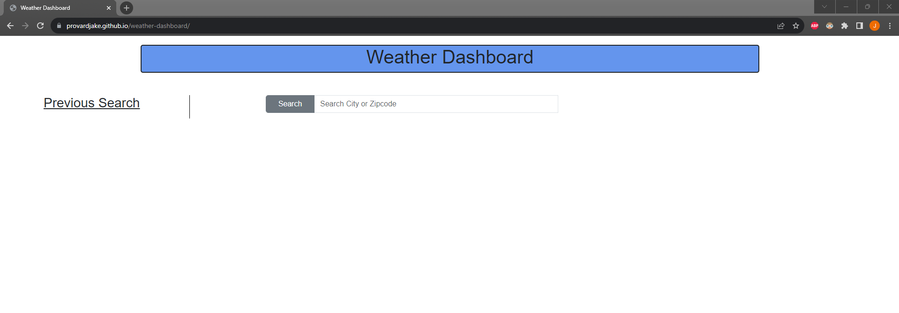

# weather-dashboard
This application allows the user to input a zip code or city. If the user enters a city they will be given a list of cities to select. Then it will display the current and future weather for that selected city. Previously searched cities will be displayed for the user to search again.

## Screenshot of deployed application

## URL of deployed application
https://provardjake.github.io/weather-dashboard/